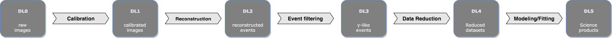
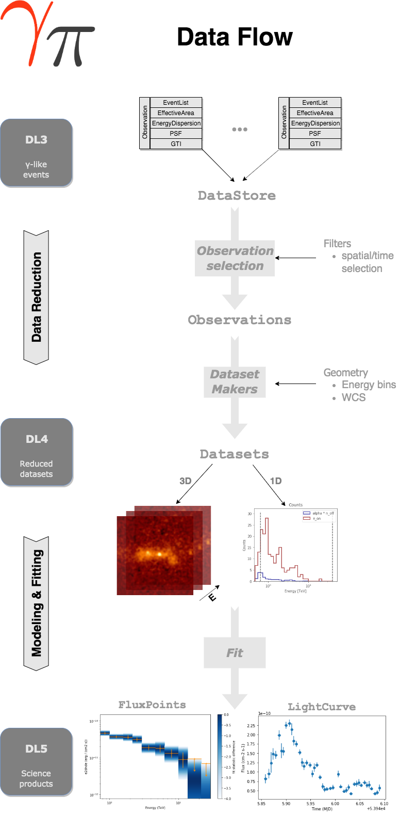
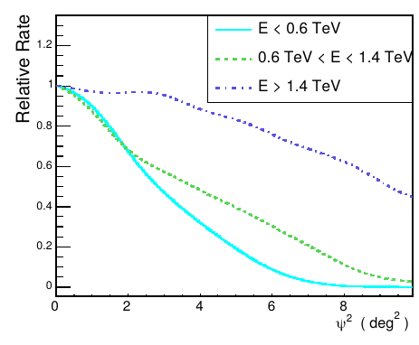
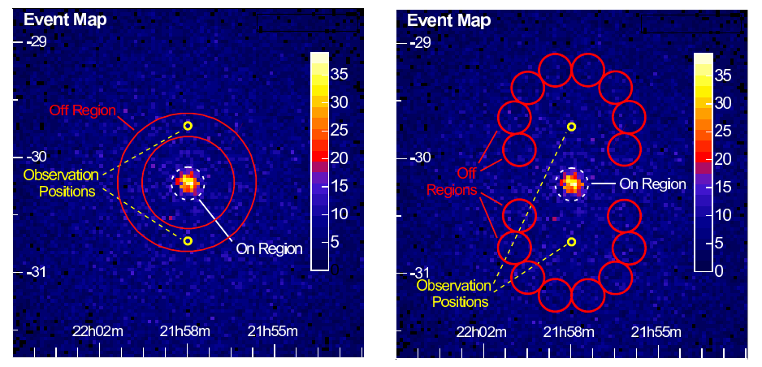

# Gammapy tutorial, Vaxjo, January 2020 - B. Khelifi, APC
Repository of the materials used for the gammapy tutorials made in Vaxjo, Sweden, in January 2020

## Table of contents
1. [Documentations](#doc)
2. [Analysis Overview](#ana)
    1. [Data format](#DL)
    2. [Data processing](#process)
    3. [TeV Background estimation](#bkg)
3. [Another paragraph](#paragraph2)

## Gammapy documentation and GitHub 

## Analysis overview 

### Data format 

### Data processing 

[Data Processing](figures/data_flow_gammapy.png)



### TeV Background estimation 

